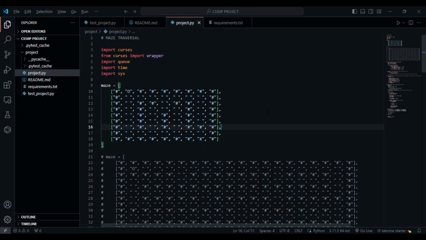

# BFS Maze Traversal
#### Video Demo: (URL of your video demonstration)
#### Description: This project implements a Breadth-First Search (BFS) algorithm to find the shortest path between the start and end points in a maze. Here, '#' denotes a wall, ' ' represents a traversable path, 'O' is the starting point, and 'X' is the target or end point.

  

Watch the demo: https://www.youtube.com/watch?v=klB4oY9OCJM

The project consists of the following files:

1. `project.py`: this file contains the entire working of the project, including the hardcoded maze pattern(in the form of a list of elements) and the functions containing the necessary code.

2. `requirements.txt`: is a text file containing the the necessary pip-installable library used(curses); other libraries used are not mentioned there as they come pre-installed, like *queue*, *time* and *sys*. We will also need the `mock` class to mock the necessary objects during testing of our function named **traverse()**.

3. `test_project.py`: is a pytest executable python file that contains tests for the functions used in the project file, to check for any discrepancies in the code. It uses the concept of creating mock values for objects like *stdscr* which is required to initialise the curses module.

The main workflow of the program is as follows:

1. The `main` function initializes the color pairs for applying in the maze in the terminal, using the `curses` library.

2. The `traverse` function is called, which uses a queue to perform the BFS traversal. The starting as well as the ending/target elements are defined at the top of the function. It then calls the `find` function to ensure the presence of the starting element as well as its location in the maze as the starting position. If the starting element is present, find function returns its position, otherwise if for some reason there isn't one it returns `None`. It starts from the initial position and explores all the neighboring cells in the maze, avoiding walls and marking visited cells to prevent revisiting them.

4. If the target position is reached, the function returns the path as a list of cell coordinates. Otherwise, it returns `None` if no path is available.

5. It renders the maze and the path being taken at each turn to better visualise the **BFS** approach. I have used "X"'s to show the steps taken before reaching the target element and thus discovering the shortest path, and the "X"'s show the path on which a particular step is being taken, and finally the shortest path is highlighted in green, and the incorrect ones are highlighted in red.

The project also includes tests written using the pytest framework to ensure the correctness of the `find`, `find_neighbors` functions.

To run the project, execute the `project.py` file, and to run the tests, execute the `test_maze.py` file with pytest.

Design Choices:

1. *Separation of Concerns*: The project follows the principle of separation of concerns by dividing the functionality into separate functions (`find`, `find_neighbours`, `print_maze` and `traverse`). This makes the code more readable and easier to maintain.

2. *Use of Queue*: The BFS algorithm is implemented using a queue data structure, which ensures that the cells are explored in the correct order, leading to the discovery of the shortest path.

3. *Curses Library*: The project uses the `curses` library to render the maze and the path in the terminal. This provides a clearer visual representation of the BFS traversal process.

4. *Testing*: The project includes tests for the core functions using the pytest framework.

Additional skills I needed to learn:

1. Use of the curses module: to implement abstraction of display of both the maze as well as the path being taken.

2. Understanding use of "mock" objects during testing.

I hope to add further functionality into it like allowing the user to input their own maze via a text file in the desired format instead of hardcoding the maze in the program itself.

**This was CS50P!**
